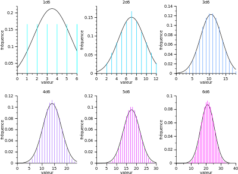

# 정규분포곡선과 확률 히스토그램

## 경험적 히스토그램 vs 확률적 히스토그램
* `경험적 히스토그램`은 어떠한 시행을 직접적으로 해보고, 그 시행에 따른 결과를 히스토그램의 형태로 표현한 것이다.
* `확률적 히스토그램`은 확률시행이 특정한 값이나 구간에 속할 확률을 알려주는 히스토그램이다. 
* 시행횟수가 **많아질수록** `경험적 히스토그램`은 점차 `확률적 히스토그램`으로 수렴한다. (*평균의 법칙*)

## 중심극한정리 (Central Limit Theorem)
* 확률시행이 점차 증가할 수록 `확률적 히스토그램`은 `정규분포곡선`에 수렴한다.    

  
### 중심극한정리의 근사
* 앞서 사용한 `표준화`를 통해서 `(실값-기대값)/표편` 정규분포곡선 상에서    
  면적을 구하는 형식으로 특정 값 및 구간에 속할 확률을 구할 수 있다.

#### 연속성 검정
* 만약 이산적인 값이 아닌 연속적인 값을 근사시킨 경우에는 이 차이를 구별해야 한다.
* 이산적인 값을 연속적인 값으로 변화시킬 떄 특정 연속 구간에 대응시키는 식이 대표적인 예이다.

## 정규분포곡선의 사용 범위
* `정규분포곡선`은 꽤 범용적이다. 원 표본이 **정규분포와 비슷**하다면 정규분포곡선으로 근사하는 **시행횟수가 크게 줄어들**긴 하지만, 시행 횟수 상의 차이가 있을 뿐 원래 표본의 분포가 **정규분포가 아니어도** **많은 시행횟수를 거치면** 대부분의 표본은 정규분포곡선에 근사한다.
* 단, `정규분포곡선`은 추출된 숫자들의 **합**에 대해서만 성립하며, **곱**에서는 미성립한다.

## 중심극한정리와 히스토그램의 수렴
* `경험적 히스토그램`의 **시행횟수**가 많아지면 `확률적 히스토그램`에 근사한다. (평균의 법칙)
* `확률적 히스토그램`의 **추출량**이 많아지면 `정규분포곡선`으로 근사한다. (중심극한정리)
* 통상적으로 **100회** 정도의 시행 횟수가 되면 **합의 확률 히스토그램**이 **정규분포곡선**에 근사.
* 만약 `확률적 히스토그램`이 근사하면 *평균*, *표준편차*, *추출 횟수*로 전체 모양을 판단할 수 있다.

## 부트스트래핑
* 만약 `확률적 히스토그램`의 추출 횟수 n이 너무 작으면, `부트스트래핑`을 실시한다.
> `부트스트래핑`은 다음과 같은 절차에 따라 실시한다.    
> 1) 별도의 추출 절차를 통해서 새로운 **부트스트랩 표본**을 형성
> 2) 이 표본을 통해서 **새로운 표본평균**을 구한다.
> 3) 위의 1), 2) 과정을 **1000번** 정도 반복해서 이 표본평균을 구한다.
> 4) 이 절차를 통해 표본평균의 확률히스토그램에 대한 **하나의 근사**를 형성한다.

